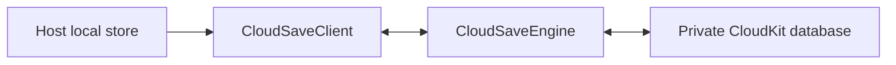

<p align="center">
  <a href="https://developer.apple.com/swift/"></a>
  <a href="https://developer.apple.com/xcode/"></a>
  <a href="https://en.wikipedia.org/wiki/List_of_Apple_operating_systems"></a>
  <a href="https://developer.apple.com/documentation/xcode/swift-packages"></a>
  <a href="https://thatfactory.github.io/cloudsavekit/documentation/cloudsavekit/"></a>
  <a href="https://en.wikipedia.org/wiki/MIT_License"></a>
  <a href="https://github.com/thatfactory/cloudsavekit/actions/workflows/ci-pr.yml"></a>
  <a href="https://github.com/thatfactory/cloudsavekit/actions/workflows/release.yml"></a>
</p>

# CloudSaveKit

A reusable `CKSyncEngine` coordinator for synchronizing app-owned local data with a private CloudKit database. ☁️



CloudSaveKit owns CloudKit synchronization mechanics while the host application remains responsible for its local persistence, record schema, merge semantics, and user experience. It deliberately has no dependency on SwiftData, Core Data, Redux, or SwiftUI.

## Responsibilities

- Restore and persist opaque `CKSyncEngine` state.
- Create and recover a custom CloudKit record zone.
- Batch pending record saves and deletions within CloudKit limits.
- Schedule automatic synchronization and expose explicit fetch, send, and combined sync operations.
- Forward fetched changes, account events, saved system fields, and semantic conflicts to the host.
- Classify failures into privacy-safe values suitable for application state.
- Preserve independent record, zone, operation, and host-persistence failures until their exact recovery conditions succeed.

## Quick start

Add CloudSaveKit to your package dependencies:

```swift
.package(
    url: "https://github.com/thatfactory/cloudsavekit.git",
    from: "0.1.1"
)
```

Implement `CloudSaveClient` in the actor that owns your local database, then configure a private CloudKit database and custom zone:

```swift
let container = CKContainer(identifier: "iCloud.com.example.game")
let zone = CKRecordZone(zoneName: "GameSave")
let configuration = CloudSaveConfiguration(
    database: container.privateCloudDatabase,
    stateSerialization: restoredState,
    zone: zone
)
let engine = CloudSaveEngine(
    configuration: configuration,
    client: localStore
)

try await engine.start()
```

Persist every state value received by `CloudSaveClient.persist(stateSerialization:)` and restore it through `CloudSaveConfiguration.stateSerialization`. Also return every locally durable unsent change from `pendingChanges()`: this is what lets the engine recover correctly after termination, relaunch, zone recreation, and iCloud account changes.

After committing local data, enqueue its durable CloudKit change:

```swift
await engine.enqueue([.save(recordID)])
```

Use `syncNow()` when the application must explicitly fetch, merge, and send before continuing:

```swift
try await engine.syncNow()
```

Automatic synchronization should remain enabled in production. Explicit operations complement the system scheduler; they do not replace durable local saves or make offline networking possible.

Call `start()` successfully before any explicit synchronization. `fetchNow()` and `sendNow()` throw `CloudSaveEngineError.notStarted` before startup and `CloudSaveEngineError.hostRecoveryRequired` after a host persistence callback fails. Once the local store is healthy again, call `start()` to rebuild from the last successfully persisted CKSyncEngine checkpoint and the host's current durable pending-change ledger.

`sendNow()` reloads that ledger before sending. This makes the host the source of truth if CKSyncEngine discarded a semantic failure or if a previously persisted checkpoint still contains a change the host has since acknowledged. Host-ledger reads and mutations are serialized and versioned; a snapshot from before a host commit is rejected, while app enqueues that race with a suspended read are replayed in their original order. After a successful send, CloudSaveKit rereads the host ledger before removing completed work; a newer save of the same record therefore remains pending instead of being erased by the older acknowledgement. A nil `record(for:)` result means the record no longer exists and uses the same reconciliation, while a thrown materialization error stops synchronization and requires host recovery. Materialization cancellation remains under CKSyncEngine's cancellation lifecycle and does not invalidate the host. Record batches are also revalidated after asynchronous materialization and rejected as a whole if an account or engine lifecycle changed while they were being built.

Opaque CKSyncEngine checkpoint writes are serialized with host-failure lifecycle invalidation. A host callback failure blocks new work and advances the lifecycle immediately, while explicit `start()` recovery waits for every earlier checkpoint write and the failed engine's teardown. A replacement engine therefore cannot start from a checkpoint that an older engine later regresses through actor reentrancy.

Known iCloud account transitions advance the engine lifecycle and block new synchronization before the host switches account-scoped persistence. The gate remains closed until the new account's durable pending ledger is restored, invalidating every pre-transition snapshot and explicit operation without allowing previous-account work to enter the new account. Transitions also clear operation and recovery state scoped to the previous account. Sign-out immediately publishes the cleared current status instead of leaving the previous account's pending or failed projection buffered.

`statusUpdates` is a current-state projection, not an event history. It begins with `.idle` and retains only the latest unconsumed status so an absent or slow observer cannot accumulate an unbounded buffer.

## Failure and retry policy

CloudSaveKit leaves temporary transport, service, authentication, throttling, and cancellation failures to CKSyncEngine's scheduler. Explicit methods and their host-ledger preflight reads still throw their underlying cancellation so the caller can finish its immediate workflow, but routine retryable errors do not become durable attention-required state.

Semantic and permanent failures are tracked independently:

- A record failure clears only when that record is saved, its deletion is acknowledged, or the host removes it from the durable pending ledger.
- A zone failure clears only after that zone succeeds.
- An explicit operation failure clears only after a later matching operation completes and every older overlapping operation of that kind has drained.
- A host persistence failure stops the engine and blocks all synchronization until a successful `start()`.

This follows [Apple's CKSyncEngine contract](https://developer.apple.com/documentation/cloudkit/cksyncengine-5sie5): the framework schedules and retries recoverable transport work, while the application persists engine state and resolves semantic record failures.

## Conflict handling

CloudSaveKit forwards `serverRecordChanged` to `CloudSaveClient.resolve(conflict:)`. A retry record must be based on the supplied server record so it retains the current CloudKit change tag. The host may accept the server value, return a merged retry record, or preserve the conflict for a user decision. Accepting the server must clear the corresponding item from the host's durable pending ledger when applying the server record; CloudSaveKit removes the same pending save from CKSyncEngine.

## Logging

CloudSaveKit logs concise synchronization lifecycle information through [AppLogger](https://github.com/thatfactory/applogger), using subsystem `com.thatfactory.cloudsavekit`, category `sync`, and prefix `☁️`. It never logs record contents or identifiers.

## Requirements

- Swift 6.4
- Xcode 27
- iOS, macOS, tvOS, watchOS, or visionOS 26+
- A private CloudKit container with CloudKit and Remote Notifications capabilities
